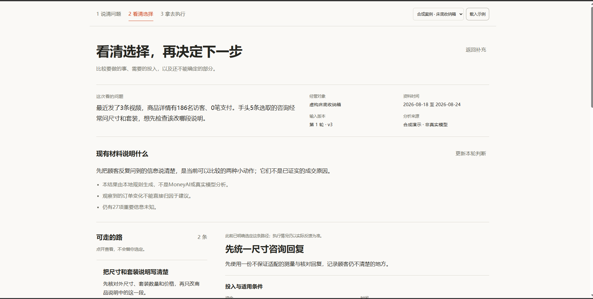

# DF-20260828-001｜第二页首屏结构评阅

**结论：先重排决策任务与操作，再调样式。** 本轮只评阅一张用户提供的第二页画面；不是完整流程审计，不是改版效果图或UI验收。

## 1. 来源与实际证据

| 项目 | 记录 |
| --- | --- |
| 提供者／日期 | 张泽厚；2026-08-28；本任务首条明确委派 |
| 来源任务 | 黑客松 Demo 统筹接续，`01a04697-8ecd-7663-8d03-a5d59511abdd` |
| 原始文件 | `C:/Users/ADMINI~1/AppData/Local/Temp/codex-clipboard-57aea48a-48d4-40e2-b913-bde20e94e5aa.png`；原件保留 |
| 共享副本 | [第二页原图](../../../demo/assets/design/feedback/DF-20260828-001-page-2-original.png)；逐字节复制，未裁切、缩放或重编码 |
| 实际尺寸 | PNG **1891×955像素**，110314字节；由文件头核对。浏览器CSS视口、DPR、缩放比例及截取方式未知，不称1920×1080截图 |
| SHA-256 | `9F2E414DB6B7BF1073DB659D75BBA311B00AC0DCB6F0F2EC0C3D63ED9DC49AED`；原件与副本一致 |
| 画面性质／状态 | 用户提供的运行截图，非本任务新抓取。可见合成床底收纳箱案例、第1轮·v3，以及“此前已明确选定这条路径”的提示；不把它当作未选路径的初始态 |
| 查看范围 | 已用view_image打开原件及保存副本；只评阅可见区域。没有第三页此次截图，没有录屏或点击过程 |
| 许可 | 用户明确允许保存本次非敏感产品截图，用于本项目设计协作和既有私有仓库的统筹集成；不是对外公开或第三方上传授权 |

## 2. 要求、意见与建议分开

| 类型 | 本轮内容与状态 |
| --- | --- |
| 用户明确要求 | 第二、三页需重组功能分区、内容承载及清晰操作，不能长文平铺；不是只换颜色或逐段套框。PC先行，中文排版重新考虑，实际看图，最终视觉由用户选择。已对应REQ-13、18—21 |
| 设计师意见 | 此次未提供单独的设计师原话或动效样本；不虚构外部背书 |
| 可保留／借鉴点 | 第二页已有三步导航、路径列表与详情的分栏雏形；演示来源、未知项和选定不等于执行的边界可见，应保留这些语义 |
| 本任务建议 | 下文三项是依据画面提出的具体调整，尚未获最终视觉批准；面板、切换、按钮文案及尺寸均待统筹整合，不新建开发任务 |

统筹已将此次明确要求登记为[REQ-20—21](../CURRENT_BRIEF.md)，并更新[视觉简报](../demo/DESIGN_BRIEF.md)。这里不再改公共基线。它纠正的是“减少无关框体＝不要功能容器”的误读，不取代风险可见、最小Demo或原生HTML技术约定。

## 3. 图像定位与可判断范围

坐标以原图左上角为原点，均为目视近似的图片像素，不是DOM或CSS测量。

| 证据 | 可见位置／事实 | 对任务的影响及限制 |
| --- | --- | --- |
| E1 | x≈306—1560，y≈140—437：大标题、副说明、问题原文及四项元信息上下展开 | 决策前的说明占据较多高度；可以压缩层级，不应删除来源与版本 |
| E2 | x≈306—1560，y≈480—710：判断标题、一段说明、三条限制与分隔线 | 真实性说明有价值，但与上下文连续占高；建议分流到相关功能区，而非删掉 |
| E3 | “可走的路”约y=748，约为截图高度的78%；右侧当前路径标题约y=782，底部仅露出投入区开头 | 路径比较进入画面较晚，当前截图看不到选路主按钮；只能判断本画面未见，不能断言整页不存在按钮 |
| E4 | “返回补充”约x=1485、y=158；“更新本轮判断”约x=1450、y=490；已有选定提示约x=718、y=754 | 操作与状态分散。选定提示存在但视觉较弱；无法从静图验证点击区域、状态更新或键盘焦点 |

流程证据：**步骤1，第二页当前画面：结构需调整；步骤2，浏览／明确选路：未操作；步骤3，第三页取用与反馈：无截图、未操作。** 不将后两步写成已审查通过或失败。

## 4. 优先三项调整与验收判据

以下判据都是后续PC浏览器验收建议，**本轮尚未执行**；三项均有第二页图像依据。

### 1）让路径比较成为首屏主体

**依据E1—E3。** 将大标题、副说明及问题原文压成简短页题和本轮问题摘要；完整原文由明确的“查看本轮资料”入口展开。对象、时间、版本与分析来源形成紧凑上下文区。路径比较和当前路径详情紧接其下，沿用已有分栏雏形。不是新增品牌，也不靠缩小所有文字挤进屏幕。

**验收：** 在真实1920×1080 CSS视口、100%缩放下，不滚动即可辨认本例两条路径、当前查看路径、已有选定状态和主要操作；当前路径的关键风险、适用条件、未知及结果类型同屏可见。完整上下文有可发现入口；不得通过截断关键风险、伪造结果或把正文缩到16px以下达成。

### 2）按“比较、判断、核对”组织内容承载

**依据E2、E3。** 路径列表用一致的动作、投入、结果类型、关键风险摘要供比较；当前路径工作区按“行动与投入”“结果与风险”“证据与决策树”组织，可采用页内分组或切换。面板边界对应功能，不按每个段落套框。详细计算、原文证据与树分支按需展开；关键风险和未知摘要在任何详情切换下仍保留在选择区。

**验收：** 同一条路径内能分别找到行动、投入、估计类型、核心风险、来源和分支条件；所有详情及报告入口明确归属当前路径。切换详情不自动选路、不丢失已选状态；收起长依据后仍能在选择前看到关键风险和未知。统计区间、假设情景、不可估使用不同文字；缺失值不显示成0。报告是完整核对材料，不承担唯一的风险披露。

### 3）把主要操作和路径状态放在一起

**依据E3、E4。** 当前路径区设置明确操作位置；“当前查看”和“已选定”分开标注。可选状态下主操作明确表示选定；已选且仍有效时主操作指向取用该行动内容。报告下载为路径内次操作，“返回补充”“更新本轮判断”归入上下文操作，避免与决策主操作争层级。此处文案仅为建议，实际事件沿用共享契约。

**验收：** 1920×1080首屏能看到一个与当前状态匹配的主要操作；浏览另一条路径或下载报告不改变既有选择。明确选定成功后才将对应路径及版本交给第三页；保存失败留在可恢复状态，不能显示已选定成功。旧版本、忙碌、失败各有文字提示；按钮不只靠颜色或hover区分，焦点可见、触达区至少44px，连续触发不重复提交。图示中的“选定不等于执行”语义仍保留。

## 5. 分类登记：第二页证据与第三页反馈不混写

| 分类 | 第二页 | 第三页：仅用户反馈及待验证建议 |
| --- | --- | --- |
| 功能分区 | E2—E3支持将说明与决策工作区重新分组 | 用户批评功能不清、信息散落；建议“执行内容／取用操作”为主体，“可选反馈／保存记录”为次区，当前无图确认其实际布局 |
| 信息层级 | E1—E3：大标题与上下文先于核心任务 | 先见所选行动及可用成品，反馈不占据取用前的门槛；待看首屏 |
| 主要操作 | E3—E4：本画面未见选路主操作，次操作分散 | 按内容类型明确复制或导出主操作；不填反馈也能取用；待点按验证 |
| 内容承载 | E2—E3：长段落连续展开，详情刚进入画面 | 用可预览的回复／步骤承载所选行动内容；不重做完整分析或另造任务看板 |
| 状态 | E4已有“此前选定”提示，不能当作未选态 | 取用、执行、反馈、本地保存、MoneyAI写入／读回分别呈现；待取得对应状态截图 |
| 动效 | 静图无法判断有无或优劣 | 未收到录屏；仅建议按现有简报用150—250ms反馈展开、切换和真实状态变化，支持减少动态效果；不模拟生成进度，不增加装饰粒子 |
| 中文排版 | E1大标题与E4辅助小字的层级落差可见；无法据此确定实际字体或CSS字号 | 三页共用中文层级；真实中文、标点、数字单位与按钮换行需实测，不另造字体主题或下载外部字体 |

中文补充判据：正文优先16px以上，辅助信息不低于12px，按钮至少44px触达区；用“69.90元”“5MiB”“第1轮·v3”及两行中文路径名检查断行、字重和数字单位混排。实际字体回退、对比度、朗读顺序和焦点未从截图验证，不宣称可访问性达标。

第三页的最低检查场景：无选定路径时不自动代选；有效行动可先预览和取用、再自愿反馈；跳过反馈保持执行及结果未知；取用不等于采用或完成。明确保存成功后才能报本地成功，读取失败不能显示为空历史；本地成功和MoneyAI健康可达不能显示为MoneyAI历史写入／读回成功。此处是既有产品约束的验收建议，不是第三页已发现的故障。

## 6. 检查、限制与回传

| 项目 | 本轮结果 |
| --- | --- |
| 原件／副本实际查看 | 已完成，两次view_image；内容一致，原件保留 |
| 文件尺寸／完整性 | PNG头1891×955；110314字节；原件与副本SHA-256一致 |
| 需求核对 | 已读项目入口、基线、视觉简报、接续及收件区；只读交叉核对第二／三页确认部分及MoneyAI边界 |
| 技能使用 | Product Design截图证据评阅；Build Web Apps的流程与验证边界。只读上下文脚本显示无已存上下文，不创建插件状态；本轮不需要21st/React Bits检索或MCP前检 |
| 内容检查 | `python scripts/verify_demo_content.py`通过1299项内容检查、15个验收定义的素材路径；不是1299项UI测试 |
| 差异与新增文件检查 | `git diff --check`通过，仅覆盖已跟踪差异；另以只读Python核对本轮3份UTF-8文档、15个相对链接、行尾空白、冲突标记和原图字节／尺寸／哈希，全部通过 |
| 浏览器与动效 | 未执行。用户及现有记录说明Browser初始化有Trusted RPC dependency可信路径错误；本任务未重试，未获Playwright回退许可，不修改信任、不读取个人浏览器数据 |
| 模型、存储、经营效果 | 未执行。此截图注明本地规则、非MoneyAI或真实模型；不能用它证明分析接通、数据读回或行动效果 |
| 当前代码与截图时点 | 其他页面任务正在共享目录推进；本图只代表用户给定时点，不宣称它仍等于最新代码渲染 |
| 回传统筹 | 2026-08-28已通过任务消息发送给“黑客松 Demo 统筹接续”`01a04697-8ecd-7663-8d03-a5d59511abdd`，含4份文件、三项建议、证据和检查限制；工具确认发送，未将发送等同于采纳或实施，不直接向三页派活 |

本轮文件仅为[反馈入口](README.md)、本记录、[资产登记](../../../demo/assets/design/feedback/README.md)及一张原图副本。未改公共基线、页面、共享样式、其他QA或MCP配置，未进行Git写入、依赖安装、模型调用、外部上传或部署。
