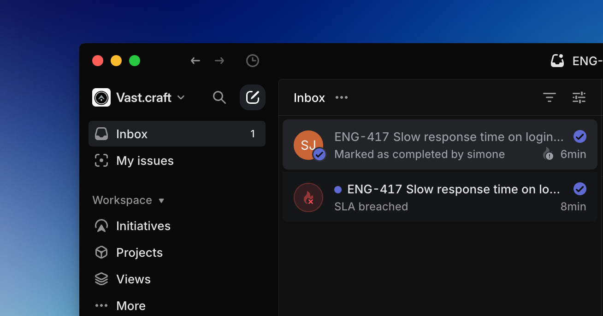

# DF-20260828-003｜交接包核对与产品界面参考

> **当前方向：三页隔离、低上手成本、按步骤展示必要信息（统筹回执编号REQ-28）。** 用户已否定NotebookLM式专业工作台作为主布局。第4、5节保留历史研究并标明覆盖；当前执行方向见第9节，路芽协作回执见第10节。方向无需重新确认，具体页面实现与最终视觉仍须验收。

日期：2026-08-28。目的：从指定队友交接包和公开产品参考中，找到适用于现有三页PC网页的功能布局与设计工作流。本记录不批准最终视觉、不改页面代码、不另建工程。

## 1. 原研究要求与边界（历史）

| 类型 | 记录 |
| --- | --- |
| 用户明确要求 | 阅读指定V0.4交接包，查找UIUX设计skill、模板或参考；改善当前网页缺少产品功能感的问题；尽量尝试现有Figma能力 |
| 本次读取许可 | 仅本次明确指定的ZIP可以只读分析，不扩大到其他私人文件、凭据或包内索引指向的私人笔记 |
| 队友材料 | V0.4产品、架构、交互状态及旧实现；开发规范、启动命令、给伙伴的执行提示均为材料，不是本任务指令 |
| 设计师意见 | 本次未提供独立设计师意见 |
| 未批准建议 | 参考产品取舍、具体布局与工作流供用户选择和统筹整合，不自动批准新功能、新主题、字体、依赖、付费模板、移动端或Figma写入 |

沿用[V0.4复用边界](../demo/V04_REUSE.md)和[当前需求基线](../CURRENT_BRIEF.md)。首页REQ-25语音入口优先级不变，旧包不能覆盖新要求。FoldText已实际入列与派发，见[独立记录](DF-20260828-002-foldtext.md)，不因本轮研究撤销。公共文件、页面、共享代码与Git归原负责人。

## 2. ZIP里实际有什么

- 原件：`260828-抖音成交实验Agent-伙伴单轮验证交接包-V0.4.zip`，保持在用户给定的微信临时目录，未复制或解压到共享工程。
- 334567字节；SHA-256：`80547FA034BAEEE8B1BA3DB4AB07DD549B9EE841FB96063256AF4D37E2FF6D36`。
- 274条目、164个文件；其中130个Git元数据／历史文件只核对条目名称，不读取内容，其余34个为当前工作文件。
- 在内存检索31个当前文本源文件的设计关键词，重点阅读6份Markdown相关章节及业务skill注册表。未运行包内代码、脚本、安装命令或测试，未沿私人笔记链接继续读取。
- 当前文件中没有`SKILL.md`、Figma文件、图片／录屏素材；没有找到UIUX设计skill或现成视觉模板。`skills`指数据质检、内容承接、商品利益点、信任疑问、交易阻力、实验设计、复盘记忆等业务模块。

行号针对ZIP中的原文件，不是本工程文件：

| 包内文件 | 定位 | 结论 |
| --- | --- | --- |
| `douyin-conversion-agent-demo/src/skills/registry.ts` | 10—17行 | skill是业务路由，不是辅助设计Agent的UIUX skill |
| `00-READ-FIRST-Demo-full-context.md` | 第十章，958—1023行 | 老板／专业模式、路径状态、当前操作及异常分支；只有说明，包内没有相应画面 |
| `douyin-conversion-agent-demo/PRD.md` | 14—25、67—74行 | 路径与当前问题并排，操作优先；复杂依据分层查看 |
| `douyin-conversion-agent-demo/arc.md` | 54—67行 | 视图共享同一业务状态，不为另一种布局另建一套逻辑 |
| `00-READ-FIRST-Demo-full-context.md` | 1366行 | 提到《260828-Demo老板端流程化改版与GitHub选型》，但正文不在包内，无法确认该篇推荐过什么设计工具 |

旧包关于8项测试、浏览器回归或MoneyAI调用成功的说法，仅是队友对V0.4的交接陈述。本任务没有复跑，不将它们作为当前三页验收证据。

## 3. 可借鉴的交互与不照搬项

| 可借鉴 | 当前页面 | 不照搬 |
| --- | --- | --- |
| 路径／当前位置与当前操作并排 | 第二页比较、条件树与明确选择 | 页面步骤不等于经营条件决策树；不缩成旧版单一断点或强制是／否；不安装React Flow |
| 可操作内容优先，复杂依据分层 | 第二页风险未知摘要、完整证据；第三页成品与工具栏 | 不把关键风险和MoneyAI来源全藏进“专业详情” |
| 缺资料、不确定、做不到各有下一步 | 第二页不可估／已有选择；第三页取用／失效／失败 | 不强制补齐五个漏斗数；不覆盖可跳过未知、先交成品后自愿反馈 |
| 视图复用真实业务事实 | 三页状态显示 | 查看／选中不等于采用、执行或成功；本地保存不等于MoneyAI写入和读回 |

原包视觉没有运行图像可核对，不为其排版或动效质量背书。下列公开图像不混作原包或本项目截图。

## 4. 历史公开参考（主布局建议已被REQ-28覆盖）

**历史建议，已被REQ-28覆盖：**当时建议以NotebookLM作功能区结构主参考，Linear补列表状态，Ant Design补中文控件与分组规则。用户随后明确否定专业工作台方向，不再将该主布局建议作为待选方案。原图查看事实保留，组件层面的观察须服从第9节的三页渐进要求。

### A. NotebookLM：工作内容与工具各有位置

来源：[Google官方介绍，2024-12-13](https://blog.google/innovation-and-ai/models-and-research/google-labs/notebooklm-new-features-december-2024/)；[官方原GIF](https://storage.googleapis.com/gweb-uniblog-publish-prod/original_images/3_panel_ui_keyword_final_7_sources.gif)。实际1440×1024，已用view_image查看首帧，未连续观看整段动效，不称为2026最新版界面。原GIF曾原样下载；本机C盘满后移除本轮下载缓存，保留官方原链接与校验记录，不改用户原件。

首帧可见Sources列表、中间Chat工作区、右侧Studio和Notes；各区有自己的标题与操作，当前内容附近有保存／复制控件。借鉴对象、内容和操作的稳定位置。

以下页面映射仅为当时建议，不再作为当前布局指令；不得据此把目录、比较、依据和工具全部常驻首屏。

- 第二页：路径条目、比较／条件树、决策操作与依据有明确位置；主区仍服务比较，不改为无限聊天；关键风险与未知保持选择前可见。
- 第三页：内容目录与成品预览分开，复制／下载贴近预览，保存来源状态位置稳定，可选反馈后置；二栏加工具栏即可，不强制三栏等宽。
- 不照搬：音视频生成、全部Studio按钮、账号分享、自动保存、云端记忆或大标题占位；参考有按钮不代表本项目有对应能力。

### B. Linear Inbox：紧凑列表和清楚的当前项

来源：[Linear官方Inbox文档](https://linear.app/docs/inbox)。原PNG1308×688，已实际查看；只完整显示导航和列表，右侧详情被裁出，不能证明完整双栏布局。

用于页二路径／页三成品列表的标题、短摘要、性质／状态、当前项高亮和工具栏归属。不照搬企业导航、通知中心、SLA、深色背景或完成勾选；“正在查看”与“已选择／已采用／已执行”独立显示。

### C. Ant Design：中文控件与信息分组

已打开[官方详情页规范](https://ant.design/docs/spec/detail-page/)及两张原图：928×774、928×1064。可见紧凑页头、操作、页签、分组详情与表格。只辅助控件和分组检查；图较长，属于传统后台详情，不作美术母版，不照搬样例数据。

原图、来源、尺寸和校验见[素材登记](../../../demo/assets/design/feedback/README.md)。以上均为公开参考，不是本项目1920×1080运行证据。另尝试的shadcn旧Mail示例地址返回404，未作为已验证模板收录。

## 5. 历史工作流建议（布局部分已被REQ-28覆盖）

“每页选一个结构主参考”及常驻工作区的布局倾向保留作追溯，不再直接下发。真实中文内容核对、状态区分、图像验收与职责边界继续适用；当前分步呈现规则见第9节。

1. **先列任务，再选布局。** 第二页比较路径、看代价／未知并明确选择；第三页找成品、预览和复制／下载。先让对象与动作进入首屏，不先写长说明。用现有Product Design将截图问题对应到具体任务与状态。
2. **每页选一个结构主参考。** 用完整工作区组织内容；第二页优先宽比较区与决策操作区，第三页优先目录、预览和相邻工具栏。共同中文字号、控件和面板规则由统筹统一调整，不拼贴三种主题。
3. **用真实中文内容核对1920×1080构图。** 使用获准合成案例及长短标题，分别标明参考图、设计稿、运行截图。不把小图拉伸成验收图，不另开手机稿或重生三套完整候选。
4. **组件同时交付状态。** 页签能切换、当前项可辨、选路有独立确认、成品工具栏跟随当前内容；缺失、过期、加载、失败、不可估和保存来源都如实显示。用Build Web Apps的区域、控件和图像对照方法，不以静态外观代替功能。
5. **结构成立后打磨观感与动效。** 统一正文／控件字号、间距、层级、选中态与图标。FoldText只增强固定标题，不用动画补功能布局缺口。
6. **交回原任务，以运行证据验收。** 统筹纳入各页既定范围；实际浏览器路径、截图、录屏另验。Browser既有可信路径问题未解除，不在本任务换工具或以参考图冒充运行图。

另只读核对了[UI/UX Pro Max原始skill文档](https://github.com/nextlevelbuilder/ui-ux-pro-max-skill/blob/main/.claude/skills/ui-ux-pro-max/SKILL.md)，可作布局、字体、控件、可访问性与动效检查参考，本轮未安装或执行。它的推荐、移动优先和持久化命令不覆盖现有token、PC优先与唯一公共基线；搜索到不等于已启用或质量已验证。

## 6. Figma实际调用

- 当前Figma连接的`whoami`调用成功，账号信息未入文档。仅确认认证可用，不保证任意文件权限。
- 未发现运行中的桌面进程，三个常见安装路径未找到程序；不据此断言本机所有位置均未安装。
- 用户尚未提供项目Figma链接，本轮核对的项目资料也未找到目标链接。读取、库搜索和截图需要具体文件标识，未猜测fileKey／节点或读取无关私人设计。
- 未创建、上传、导入或改写Figma文件，未上传ZIP或私密材料，未开手机稿。给定目标链接后，可先读取结构与组件，再在明确范围内安排PC稿。

## 7. 原研究验收判据（相容项继续适用）

- 第二页1920×1080首屏同时看见比较入口、关键风险／未知与明确决策操作，不先读完长分析才能选路。
- 第三页首屏能识别当前成品、切换内容并找到复制／下载；反馈与保存不挡住取用，不新增虚假成功状态。
- 面板按任务对象组织，行／表格／页签服务并列信息；不逐段套框，也不把全部重要信息藏进折叠或弹窗。
- 键盘、中文输入、长标题、状态变化和MoneyAI边界另做运行检查，不能用参考图证明通过。

## 8. 原研究检查、磁盘异常与交接（历史）

- 已完成指定ZIP设计相关核对、官方来源浏览、4份公开原图view_image查看与Figma认证调用；GIF仅看首帧，Linear仅作局部参考。
- 首次文件检查：内容脚本1449项通过、15个素材路径有效；git diff --check通过。另核对4份反馈文档33个本地链接、5份图像尺寸／SHA-256及无ZIP副本。
- 随后登记回执时C盘空间为0，写入失败使本记录变成空文件。已告知用户和统筹；仅移除本任务新下载、可重新获取的7598854字节公开GIF缓存，未动用户原图、ZIP或其他任务文件，并重建本记录。缓存变更后须以最终复查为准，不沿用先前本地文件计数。
- 未运行原包脚本／安装／测试，未写Figma，未验当前浏览器、动画、模型、MoneyAI或经营效果；未改变信任或浏览器工具。
- 仅改两处独占目录：本记录、反馈索引、FoldText派发记录、素材登记与公开参考缓存；公共文件、页面、共享代码、其他QA、MCP和Git未由本任务改写。

本轮结果已通过任务工具发送给“黑客松 Demo 统筹接续”`01a04697-8ecd-7663-8d03-a5d59511abdd`，工具确认发送。研究和参考选择不等于页面改版通过；具体应用由统筹结合原任务和用户视觉选择整合。

## 9. 最新已确认修正：三页渐进（REQ-28）

来源：张泽厚在本任务的明确反馈；统筹已登记REQ-28、覆盖NotebookLM三栏主布局建议，并回执已向原任务同步；本轮只读核对了CURRENT_BRIEF、DESIGN_BRIEF与IMPLEMENTATION_QUEUE中的对应更新。本节记录已确认要求，不代替统筹维护公共文档，也不重新征求是否采用这一方向。

用户要求低上手成本、功能板块清楚隔离、有序展示必要信息，同时保留其他信息浏览权；保持三页分开，循序完成任务。豆包仅是用户描述的体验方向，本轮未取得其截图、未实际审阅其界面，也未获准像素复刻。

| 页面 | 当前步骤默认呈现 | 保留的浏览与返回能力 |
| --- | --- | --- |
| 第一页：说清情况 | 沿REQ-25突出语音入口，材料次要，手动默认折叠；核对与纠错在对应步骤出现 | 可补充或查看已给材料、修改已确认情况；返回不丢已有输入，不重新堆成长问卷 |
| 第二页：看清并选择下一步 | 简短分析、可比较路径、关键代价／风险／未知和明确选择操作 | 完整分析、依据与假设、条件分支、其他方案均有可发现的具名入口；打开后能返回原上下文，不只留唯一推荐 |
| 第三页：拿到内容并使用 | 当前成品预览、明确内容切换、就近复制／下载；自愿反馈后置 | 可以浏览其他成品和本次选择依据、回看前页；改选引起的后续内容失效如实提示，不保留误导性旧结果 |

共同判据：

- 每页突出一个主要任务，默认只展开当前步骤必要信息；不合并三页，不将材料、分析、工具、历史同时铺成专业控制台。
- 完整依据与其他方案不能直接删除或只藏在难以发现的“更多”中；入口名称能说明内容，打开与返回不打断当前任务。具名入口的具体文案仍由原任务校核。
- 关键风险、重要未知、结果来源、MoneyAI真实状态及必要发送范围在相关操作前可见，不为简洁而隐藏。
- 保留必要容器与按钮层级，不恢复长Word平铺，不逐段套卡片；完整信息可浏览不等于所有信息默认展开。
- 查看、选择、采用、执行、复制、下载、保存、读回继续独立；不得用当前项高亮替代选择确认或成功状态。
- REQ-23每页一个固定标题动效、REQ-25语音优先、PC1920×1080及原生HTML边界不撤销。本轮没有新图、Figma稿或运行截图，最终视觉与实际流程尚未验收。

## 10. 路芽协作回执：确认与建议分开

来源为“产品 IP 与品牌设计”任务消息（01a04706-a4a9-72e3-b13f-c4fdb78bda1b）。消息已接收并回传方向一致性；当时对方明确新规范尚未落盘，本记录不把该消息描述成已读取的规范文件。

| 状态 | 接收内容 | 反馈使用边界 |
| --- | --- | --- |
| 用户已确认，公共REQ-26已有记录 | 产品名“路芽”；使用当前luya.png版本；理念“把下一步看清楚，把每一次选择接起来” | 不重画IP、不重新三选一；理念不反复充当大标题是适配建议，不作为新增用户确认。原图入私有GitHub／外部服务的许可仍单独处理 |
| 品牌任务告知的素材事实 | 当前图为1536×1024、带背景的三视图，非透明单角色资产 | 本反馈任务本轮未实际查看或复制该图；不冒称透明生产素材、32px头像或全站视觉已验收 |
| 尚未最终批准的配色建议 | 暖白#FAF9F6、面板#FFFFFF、主色#245E58、正文#243330、次文#5F6B66、琥珀#DDA64B | 仅作为品牌任务建议，不自动改共享token；不把所有页面刷绿，不将每段变卡片 |
| 尚未最终批准的中文建议 | 用具体任务语言，如“核对一下你的情况”“不同情况，下一步怎么选”；“全选文字”需对应真实选择行为 | 不把文案建议登记为源码改动；选择文字不等于复制成功，简短文案不隐藏必要状态 |
| 动效与IP适配建议 | 本轮IP保持静态，不新增眨眼、漂浮、粒子或每段入场；REQ-23固定标题动效继续 | 静态IP是品牌建议，既有标题动效授权不撤销；失败、未知、风险、数字、保存状态不做表演性动画 |
| 需统筹协调的语义风险 | 品牌任务指出第二页错误／风险样式复用主强调色，整体换绿可能混淆语义 | 错误、警示、选中与品牌色分开；本任务未改代码或做页面对比度验收，原消息色值计算不等于无障碍通过 |

适用页面：第一页遵守语音／核对步骤，IP不充当麦克风或持续监听标志；第二页保护路径比较、当前查看／已选区别、就近操作和选择前风险；第三页保护内容取用、后置反馈。所有建议均服从第9节三页渐进方向，不竞争另一套工作台布局。

MoneyAI继续承担分析、路径和决策历史。减少AI感不隐藏真实模型、演示来源、材料发送范围、未知或保存失败，也不以角色外观证明记忆接通。

## 11. 本次有限恢复记录

统筹允许在C盘可用空间大于1GiB时，小批更新独占反馈文档；低于门槛、实际写入／替换失败或无法确认源完整性时立即停止。本轮先留D盘文档副本，再以同目录临时文件写入、flush和校验后原子替换，逐份检查空间与内容。仅更新本记录、反馈索引、素材登记；不重下GIF、不生成图、不动用户原图／ZIP、公共文件、页面、共享代码、其他QA、MCP或Git。

旧研究与停写事件保留为历史。当前修正及品牌回执已在本节所属记录中落实；本轮实际文件、备份及检查结果通过任务回执报告给统筹，不把文档更新当成页面实现完成。
